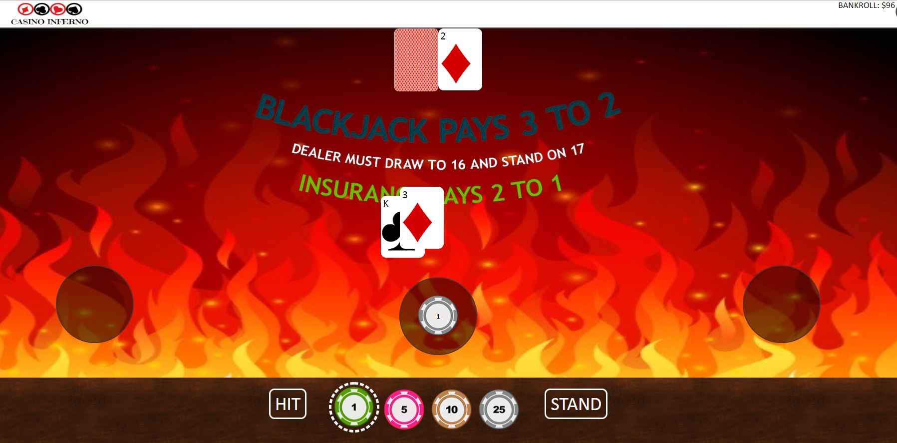

# Casino Inferno README

[Casino Inferno](https://ko38.github.io/Casino-Inferno/) is a free casino where players can enjoy gaming.



## Games
* Blackjack - the most popular card game in the world.
* Baccarat (Coming soon) - the most popular card game among high rollers.
* Roulette (Coming soon) - the most common casino game.
## Blackjack
* The game is played with two decks of 52-card decks.
* Aces may be counted as 11 or 1, 2-9 as the face value, and tens and face cards are counted as 10.
* To beat the dealer, the player must not bust (not go over 21).
* The following are the choices available to the player:
  * Hit
  * Stand
* If dealt a natural 21, the player gets paid 3 to 2 automatically.
* If neither the player nor the dealer busts, then the one with a higher total of face values wins.

## Technologies
* Javascript
  * The de facto standard of modern web development.
* Webpack
  * An open-source Javascript bundler. 
* Babel
  * A open-source transpiler used to convert EC6 into backward compatible version of Javascript.

### ES6 syntax
Used a lot of ES6 syntax. 
* import
* let
* class
```javascript
import setUpBankroll from "../setUpBankroll.js";
import BlackjackGameView from "./blackjackGameView";

window.onload = () => {
  setUpBankroll();
  let blackjackGameView = new BlackjackGameView();
  blackjackGameView.startGame();
};

class BlackjackGame {
  constructor(render) {
    this.render = render;
  }
}
```

The open-source transpiler Babel then converts this to ES5.

### Vanilla Javascript for all the frontend manipulation.
```javascript 
hideAllCards() {
  for(let seatNo = 0; seatNo < seatNumber; seatNo++) {
    for (let i = 0; i < cardCount; i++) {
      document.getElementById(`card${seatNo}${i}`).style.visibility = "hidden";
    } 
  }
}
```
Used the original Javascript DOM manipulation. As stated on [Vanilla JS](http://vanilla-js.com/), Vanilla JS outperforms any Javascript framework.

### Seclude game logic for better maintainability
```javascript 
this.game = new BlackjackGame();

this.game.deal();
this.game.hit();
this.game.stand();
```

Like most Javascript libraries that manage application state, the maintainability relies on how separate the logic is from the view. Frameworks like [Redux](https://redux.js.org/) use a store to put all the logic. Likewise, BlackjackGame is a class that holds all the game logic. The maintainability increases substantially.